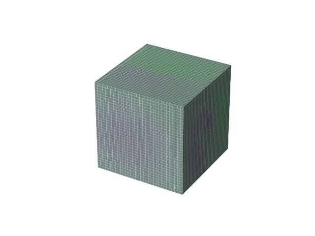
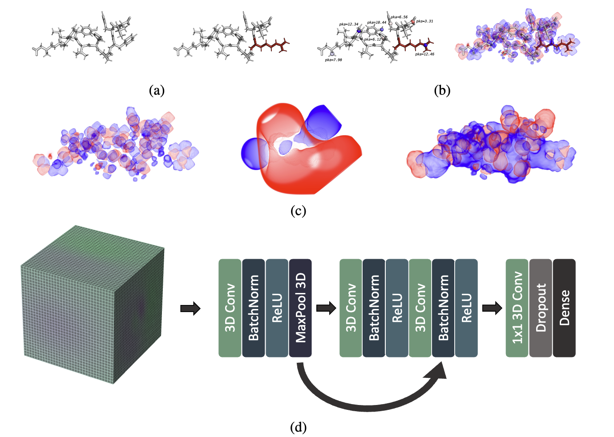

<!-- PROJECT LOGO -->
<br />
<div align="center">
  <a href="https://github.com/florisvdf/chargenet">
    
  </a>

<h3 align="center">ChargeNet</h3>

  <p align="center">
    Predicting protein variant properties using electrostatic representations
  </p>
</div>


<!-- TABLE OF CONTENTS -->
<details>
  <summary>Table of Contents</summary>
  <ol>
    <li>
      <a href="#about-the-project">About The Project</a>
    </li>
    <li>
      <a href="#getting-started">Getting Started</a>
      <ul>
        <li><a href="#prerequisites">Prerequisites</a></li>
        <li><a href="#installation">Installation</a></li>
      </ul>
    </li>
    <li><a href="#usage">Usage</a></li>
    <li><a href="#license">License</a></li>
    <li><a href="#contact">Contact</a></li>
  </ol>
</details>


<!-- ABOUT THE PROJECT -->
## About The Project

<br />
<div align="center">
  <a href="https://github.com/florisvdf/chargenet">
    
  </a>
</div>


This repository provides the full implementation of the ChargeNet pipeline described in the preprint "Predicting protein variant properties with electrostatic representations". While the original experiments were executed on a proprietary commercial AWS SageMaker account and therefore cannot be shared directly, all code and configuration necessary to reproduce the experiments independently are included here.

<p align="right">(<a href="#readme-top">back to top</a>)</p>


<!-- GETTING STARTED -->
## Getting Started

To train ChargeNet on your own dataset, follow the instructions below.

### Prerequisites

ChargeNet relies on two important tools:

1. A mutagenesis tool. This can be either [`foldx`](https://foldxsuite.crg.eu/) or [`pymol`](https://www.pymol.org/).
2. `apbs`, software for continuum electrostatics computation.


`foldx` provides free academic licenses, and `pymol` can be installed through the schrodinger anaconda channel with:

   ```sh
   conda install -c conda-forge -c schrodinger pymol-bundle
   ```

If you are using `foldx`, ensure that there is an executable named `foldx` added to your `PATH` environment variable and that you have an environment variable named `ROTABASE_LOCATION` storing a path pointing to a rotabase file named `rotabase.txt`. 

Precompiled binaries of `apbs` can be found at https://github.com/Electrostatics/apbs/releases. Ensure that you also have `apbs` added to `PATH`.


### Installation

1. Clone the repo
    ```sh
    git clone https://github.com/florisvdf/chargenet.git
    ```
2. Install 

   ```sh
   cd chargenet
   ```

    Using [uv](https://docs.astral.sh/uv/)
    ```sh
    uv sync
    ```
    Using pip
    ```sh
    pip install .
    ```

<p align="right">(<a href="#readme-top">back to top</a>)</p>


<!-- USAGE EXAMPLES -->
## Usage

```python
import pandas as pd
from chargenet.pipelines import ChargeNet

# ChargeNet assumes a column named "split" is present with column values "train", "valid" and "test", as well as a column storing the target to predict.
df = pd.read_csv("my_dataframe.csv")
pipeline = ChargeNet(
   pdb_file_path="my_structure.pdb",
   reference_sequence="MYREFERENCESEQWENCE",
   target="my_target",
)
# Fit ChargeNet
pipeline.run(df)
# Make predictions
predictions = pipeline.predict(df)
```

> [!CAUTION]
> ChargeNet stores electrostatic representations in an `ElectrostaticDataset` object in order to not recompute these representations during inference. This means that one must pass a dataframe to `predict` that is identical to the one passed to `run`.

It is recommended to either precompute electrostatics for your dataset by setting `write_electrostatics_path`, that can then later be loaded using the `electrostatics_path` parameter, and/or to run ChargeNet with as many cores as possible, 
by setting the `n_cores` parameter. This is because the computation of electrostatics is computationally expensive. Computing electrostatics for a dataset with 3000 variants of 400 residues takes around an hour when using 60 cores of an AWS sagemaker ml.g5 instance.

### ChargeNet Parameters

| Parameter                 |  Type | Default | Description                                                                                                                                                                                                |
|---------------------------|:-----:|---------|------------------------------------------------------------------------------------------------------------------------------------------------------------------------------------------------------------|
| pdb_file_path             | str   | na      | Path to a `.pdb` file.                                                                                                                                                                                     |
| reference_sequence        | str   | na      | Amino acid sequence of the reference as a single string of single letter amino acid codes.                                                                                                                 |
| target                    | str   | na      | Name of the column in the training data dataframe that stores the target values.                                                                                                                           |
| mutagenesis_tool          | str   | foldx   | Mutagenesis tool to use. Options: foldx, pymol.                                                                                                                                                            |
| use_ph                    | int   | 0       | Compute electrostatics at a pH value stored in a optional column named "ph". 0: no, 1: yes.                                                                                                                |
| use_temp                  | int   | 0       | Compute electrostatics at a temperate in Kelvin stored in a optional column named "temperature". 0: no, 1: yes.                                                                                            |
| channel_configuration     | str   | all     | Which electrostatic quantities to compute as input channels to the 3D CNN. Options: charge, charge_density, potential, charge_and_charge_density, charge_and_potential, charge_density_and_potential, all. |
| resolution                | float | 1.5     | Resolution in angstrom at which the electrostatic quantities are computed. The inputs to the 3D CNN will have voxel edge lengths of this value.                                                            |
| out_channels              | int   | 13      | Number of 3D Conv layer layer output channels.                                                                                                                                                             |
| n_blocks                  | int   | 1       | Number of 3D Conv residual blocks.                                                                                                                                                                         |
| kernel_edge_length        | int   | 3       | Length of all edges of the 3D Conv layer kernel.                                                                                                                                                           |
| pooling_edge_length       | int   | 3       | Length of all edges of the 3D max pooling layer.                                                                                                                                                           |
| dropout_rate              | float | 0.30    | Dropout value of the dropout layer prior to the final dense layer of the 3D CNN.                                                                                                                           |
| batch_size                | int   | 20      | Number of samples passed to the 3D CNN in a single forward pass.                                                                                                                                           |
| epochs                    | int   | 300     | Number of training iterations.                                                                                                                                                                             |
| learning_rate             | float | 1e-4    | Learning rate passed to the optimizer.                                                                                                                                                                     |
| loss                      | str   | mse     | Loss function for training the 3D CNN. Options: mse, mae, huber.                                                                                                                                           |
| optimizer                 | str   | adam    | 3D CNN optimizer. Options: adam, adamw.                                                                                                                                                                    |
| weight_decay              | float | 5e-6    | Optimizer weight decay.                                                                                                                                                                                    |
| patience                  | int   | 20      | Early stopping criterion. If loss doesn't improve after this many iterations, training will stop and best weights will be restored.                                                                        |
| device                    | str   | cpu     | Device for training and inference. Options: cpu, gpu.                                                                                                                                                      |
| n_cores                   | int   | 4       | Number of cores for performing mutagenesis and electrostatics computation.                                                                                                                                 |
| intermediate_data_path    | str   | None    | Data path for storing intermediate outputs (mutated structure, pqr files, etc). By default, a temporary directory will be created.                                                                         |
| electrostatics_path       | str   | None    | Path to precomputed electrostatics matching the index of the samples in the dataframe.                                                                                                                     |
| write_electrostatics_path | str   | None    | Path to which computed electrostatics should be written as a `.h5` file.                                                                                                                                   |                                                                                                                                 |

<p align="right">(<a href="#readme-top">back to top</a>)</p>


<!-- LICENSE -->
## License

Copyright 2025 International Flavors and Fragrances, Wageningen University & Research

All software is licensed under the MIT License; you may not use this file except in compliance with the MIT license. You may obtain a copy of the MIT license at: https://mit-license.org

All other materials are licensed under the Creative Commons Attribution 4.0 International License (CC-BY). You may obtain a copy of the CC-BY license at: https://creativecommons.org/licenses/by/4.0/legalcode

Unless required by applicable law or agreed to in writing, all software and materials distributed here under the MIT or CC-BY licenses are distributed on an "AS IS" BASIS, WITHOUT WARRANTIES OR CONDITIONS OF ANY KIND, either express or implied. See the licenses for the specific language governing permissions and limitations under those licenses.

<p align="right">(<a href="#readme-top">back to top</a>)</p>


<!-- CONTACT -->
## Contact

Floris van der Flier - [@florisvdf](https://bsky.app/profile/florisvdf.bsky.social) - floris.vanderflier@wur.nl


<p align="right">(<a href="#readme-top">back to top</a>)</p>


<!-- MARKDOWN LINKS & IMAGES -->
<!-- https://www.markdownguide.org/basic-syntax/#reference-style-links -->
[license-shield]: https://img.shields.io/github/license/florisvdf/chargenet.svg?style=for-the-badge
[license-url]: https://github.com/florisvdf/chargenet/blob/master/LICENSE.txt
[Python.org]: https://img.shields.io/badge/python-3670A0?style=for-the-badge&logo=python&logoColor=ffdd54
[Python-url]: https://www.python.org/
